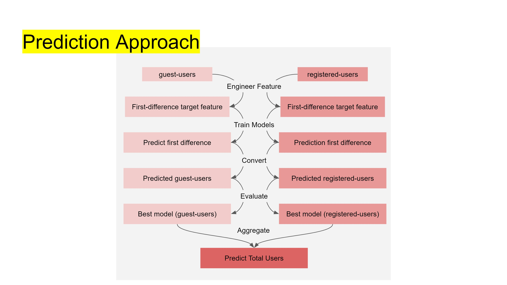
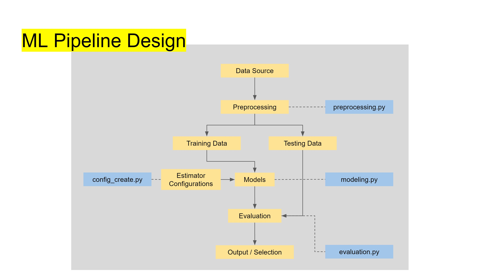

## Objective
This project is based on a dataset on e-scooter rental demand over 2 years (2011 and 2012), with datetime and weather data. The demand is split between guest users and registered users, while the project's objective is to predict the total (guest + registered) demand.

## Key Requirements
This project runs on Python 3.6.8. For libraries and dependencies used, please refer to the requirements.txt in the same directory.

## Directory for current package
<ul>
  <li><b>Project Folder</b></li>
    <ul>
      <li><b>mlp</b></li>
        <ul>
          <li>config_create.py - <i> Generates a models_config.yml file for models' parameters for grid search</i></li>
          <li>preprocessing.py - <i> Preprocess input dataset, and generate train and test sets</i></li>
          <li>modeling.py - <i> Script for containing model training and scoring functions</i> </li>
          <li>evaluation.py - <i> Final script to execute model training and evaluations</i> </li>
          <li><b>Data</b></li>
            <ul>
              <li>models_config.yml - <i>config file to be generated</i></li>
              <li>X_test.pkl - <i>pickled predictors test data to be generated</i></li>
              <li>X_train.pkl - <i>pickled predictors train data to be generated</i></li>
              <li>y_test.pkl - <i>pickled target test to be generated</i></li>
              <li>y_train.pkl - <i>pickled train train data to be generated</i></li>
            </ul>
          <li><b>output</b></li>
          <ul>
            <li>gue_model_<i>modelname</i>.pkl - <i>pickled trained best model for guest to be generated</i></li>
            <li>reg_model_<i>modelname</i>.pkl - <i>pickled trained best model for registered to be generated</i></li>
            <li>metrics_reg_gue.csv - <i>csv of metrics for all models on registered and guest to be generated</i></li>
            <li>metrics_total.csv - <i>csv of metrics from combined best models for total users to be generated</i></li>
            <li>total_predict.pkl - <i>pickled predicted total users to be generated</i></li>
          </ul>
        </ul>
      <li>EDA.ipynb</li>
      <li>run.sh</li>
      <li>requirements.txt</li>
      <li>README.md</li>
    </ul>
</ul>

## Model Design
The primary objective is to predict that total users for specific timings. From Exploratory Data Analysis conducted, there are 2 main user groups - registered and guest, each with their own distinct usage behaviours based on time and weather. It is observed that is time based trend - and overall incremental in usage volume from 2011 to 2012 end.

With these in mind, it is decided that each user group will be predicted individually, and then aggregated to give the primary target - total users.
Additionally, stationarity is introduced to remove the time trend effects, by using the first difference of 24 hour gaps.

Therefore, the base predictions will be on the first difference values, which will be added to the corresponding actual day before (24hours) user volumes, to retrieve the predicted registered/guest user volumes individually.
</img>
<b>The key predictors (at abstraction) used are:</b>
1. Day of the week
2. Hour of day
3. Month
3. Weather condition
4. Feels-like-temperature
5. Temperature
6. Windspeed
7. PSI

<b>The cross-validated models in selection are:</b>
1. Lasso
2. Random Forest
3. GradientBoosting
4. XGBoost
 

<b>Cross-validation methodology:</b> Time series split
 

<b>Evaluation metric :</b> Root mean squared error, r2 on (On registered users and guest users post conversion from predicted first difference, and finally on total users)

Note: Temperature and feels-like-temperature were observed to be highly collinear, however both were kept as predictors, with the decision to allow freedom for the models to decide the importance of features.

## Pipeline Design
The pipeline is built to run in 3 main steps:
1. <u>Step 1 - Prepocessing.py</u>

    It draws the dataset from the target URL, cleans the data, feature engineer and splits the dataset into train and test sets.
    - Data cleaning include correcting erroneous weather data; forward filling missing observations for some dates.
    - Features engineered include deriving the day of the week and month from the original date feature; applying first difference to 24 observations(24 hours/1 day) earlier; dummy coding categorical features; apply min/max scaling on numeric features
    - Train test split: with data sorted in datetime chronology, the train set is the first 80%, and test set is the last 20%.
    - Note: command line configurable with -l / --load (for dataset address), and -ts / --testsize (for test size from dataset, float input)
2. <u>Step 2 - config_create.py</u>

    Generates a .yml file of configurations of parameters grids to be used in grid search. To be used to configure the parameters for grid search.
3. <u>Step 3 - evaluation.py (uses functions from modeling.py) </u>

    - Trains models and evaluates best models for each target(guest_users, registered_users)
    - Generates a pickled best model each for guest and registered users.
    - Generates predicted value of total_users on the test set.
    - Generates metrics csv files
    - Note: command line configurable with -a / --all (run full evaluation process on all models and user group), and -r / --registered (individual model to evaluate for registered, input for -a has to be n for this to work), and -g / --guest (individual model to evaluate for guest, input -a has to be n for this to work)

</img>

## Conclusion
1. <u>Results: </u>

The best models for registered and guest users have both been evaluated to be the Random Forest Regressor.

For registered users, the resulting r2 and rmse are 0.8149 and approx. 1054 respectively.

For guest users, the resulting r2 and rmse are 0.6516 and approx 231 respectively.

For the aggregation on total users, the resulting r2 and rmse are 0.8106 and approx 1157 respectively.

2. <u>Limitations: </u>

Ultimately these best models are selected, with random states set to 42. And more effective combination of models can possibly be found with other random states, by virtue of different random starting deciding predictors of trees for random forest, or different random starting weak learners of boosting methods.

On the deployment and business side, this model can at best, only predict a day in advance of the next day's demand volume to the hour, since it just predicts the difference and adds on the current day's actual volume, in order to predict each user group volume. Additionally, predicting into the future will also rely on weather forecast, which is not fully reliable, further adding to inaccuracies in the model.

## Appendix

1. [Slides for presentation](https://docs.google.com/presentation/d/1AdkCS9lyFALH0EA8BPTpSFRL7biaJQMMXZL_55JEOjo/edit?usp=sharing)
2. [Google Colab Notebook for EDA](https://colab.research.google.com/drive/1JCNGlsByr1Uurm2DR6UY3ryBE2a00Sus?usp=sharing)
